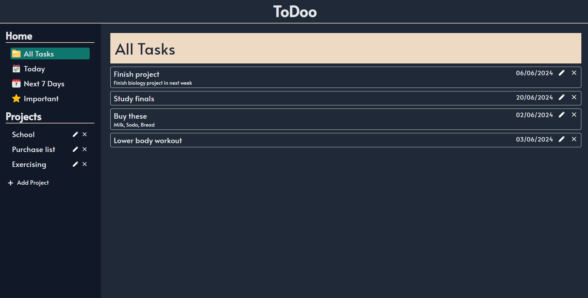
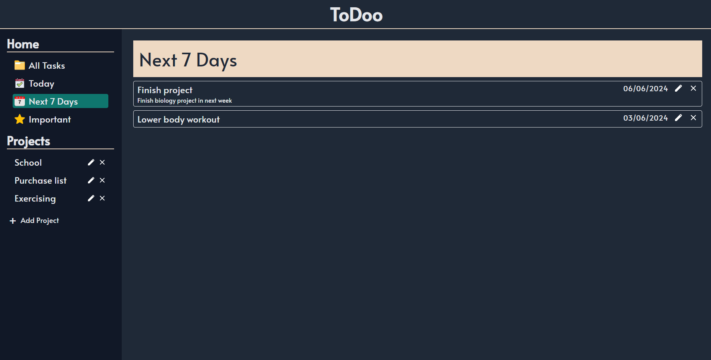

# To-Do-App (Deployed to `gh-pages`)
## Deployment address: [`myinan.github.io/to-do-app/`](https://myinan.github.io/to-do-app/ "myinan.github.io/to-do-app/")
### A useful to-do application built with Vanilla Javascript. Features include task creation, deletion, and categorizing tasks. Implemented a clean and minimalistic user interface.

## Table of Contents
- [Features](#features)
- [Demo](#demo)
- [Installation](#installation)
- [Usage](#usage)
- [Technologies Used](#technologies-used)
- [Contributing](#contributing)
- [License](#license)
- [Contact](#contact)

## Features
- Creating projects and adding tasks spesific to projects
- Task creation, deletion and categorization
- Clean and minimalistic user interface

## Demo
**Check out the live demo [here](https://myinan.github.io/to-do-app/).**




## Installation

1. Clone the repository:
    ```bash
    git clone https://github.com/myinan/to-do-app.git
    ```

2. Navigate to the project directory:
    ```bash
    cd to-do-app
    ```

3. Install dependencies:
    ```bash
    npm install
    ```

4. Start the development server:
    ```bash
    npm start
    ```

5. Open your browser and go to `http://localhost:3000`

## Usage
- **Create Project:** Use the relevant input field to create a project.
- **Add and Categorize Tasks:** Add tasks to individual projects. Favorite a task for further categorizing.
- **Remove Tasks:** Click the "X" button next to each task to remove it. 

## Technologies Used
- Vanilla JavaScript
- HTML, CSS
- gh-pages

## Contributing
Contributions are welcome! Please feel free to submit a Pull Request.

## License
This project is licensed under the MIT License.

## Contact
Created by [Yasir İnan](https://github.com/myinan) - feel free to contact me!
